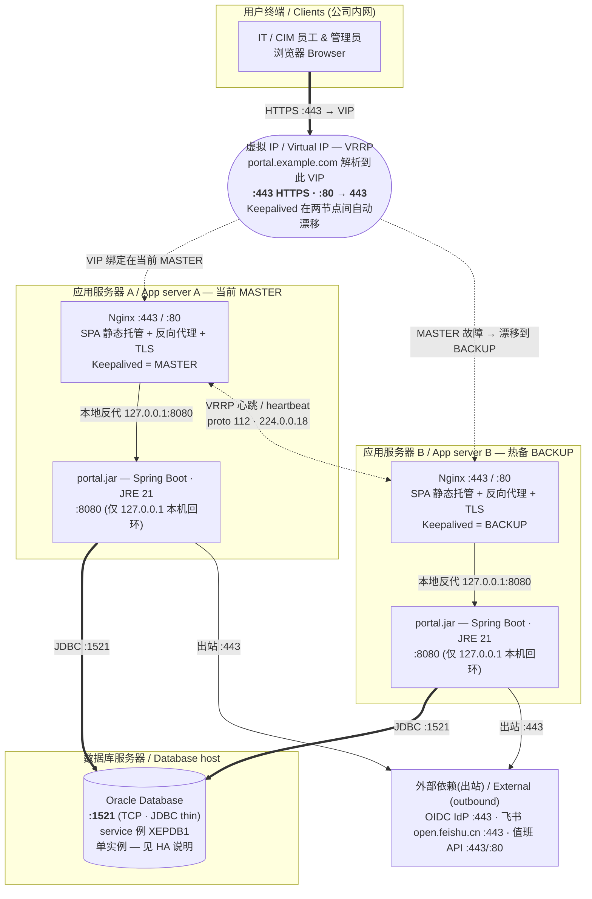

# CIM Portal 高可用部署架构 / HA Deployment Architecture

> 面向 CNO 部门。双服务器高可用(任一服务器故障,另一台继续提供服务)+ 独立 Oracle 数据库。系统级部署拓扑,非代码结构。
> For the CNO team. Two-server high availability (if one server fails, the other keeps serving) + a separate Oracle database. System-level deployment topology, not code structure.

## 拓扑总览 / Topology

**一句话:** 用户通过 **HTTPS 443** 访问一个**虚拟 IP(VIP)**;VIP 由 Keepalived 绑定在当前主节点(A)。两台**完全相同**的应用服务器各自运行 Nginx(供 SPA + 反代)与 `portal.jar`(本机 8080),都连同一个 **Oracle(1521)**。主节点故障时,Keepalived 通过 VRRP 心跳检测并把 VIP **自动漂移**到备节点(B),服务不中断。后端是**无状态 JWT** 资源服务器(无服务器端会话),因此任一节点都能处理任意请求,故障切换不丢登录态。

**In one line:** users hit a **Virtual IP** over **HTTPS 443**; Keepalived binds the VIP to the current master (A). Two **identical** app servers each run Nginx (SPA + proxy) and `portal.jar` (local 8080), both connected to the same **Oracle (1521)**. If the master fails, Keepalived **floats the VIP** to the backup (B) via VRRP — no downtime. The backend is a **stateless JWT** resource server (no server-side session), so either node serves any request and failover loses no login state.

---

## 对外端口 / External-facing ports

> CNO 防火墙只需对用户网段放行 VIP 的 443(及可选 80)。所有动态请求与后端均在内部网络。

| 入口 Entry | 端口 Port | 协议 Protocol | 暴露范围 Exposed to | 说明 Notes |
|---|---|---|---|---|
| **虚拟 IP (VIP)** | **443** | HTTPS / TCP | 用户内网 intranet | **门户唯一对外入口**;DNS 指向 VIP;TLS 在 Nginx 终止 |
| **虚拟 IP (VIP)** | **80** | HTTP / TCP | 用户内网 | 可选,301 跳转到 443 |

每台服务器的 Nginx 同样监听 443/80(VIP 当前所在节点对外生效;另一节点待命)。

---

## 内部端口(部署需放行) / Internal ports (open for deployment)

| 源 From | 目标 To | 端口 Port | 协议 | 说明 Notes |
|---|---|---|---|---|
| App A ↔ App B | 对端节点 peer | VRRP | **IP proto 112**(组播 `224.0.0.18`) | Keepalived 心跳,决定 VIP 归属 |
| Nginx(本机) | portal.jar(本机) | **8080** | HTTP / TCP(**仅 127.0.0.1**) | 每台机内反代,**不跨网络、不对外** |
| App A | Oracle DB | **1521** | TCP / JDBC | 数据库连接 |
| App B | Oracle DB | **1521** | TCP / JDBC | 数据库连接(同一库) |

## 出站端口 / Outbound (from each app server)

| 目标 To | 端口 | 协议 | 何时 When |
|---|---|---|---|
| OIDC IdP (issuer) | **443** | HTTPS | 登录令牌校验(`prod` = oidc),拉取 JWKS |
| `open.feishu.cn` | **443** | HTTPS | 管理员启用飞书后:访问申请 / 反馈 |
| 值班系统 API | **443 / 80** | HTTP(S) | 管理员配置值班接口后 |

---

## 防火墙要点 / Firewall summary (CNO)

- **对用户**:仅放行 **VIP:443**(及可选 80)。其余拒绝。
- **两台 App 之间**:放行 **VRRP(IP 协议 112,组播 224.0.0.18)** 供 Keepalived 心跳。
- **App → DB**:两台服务器均放行 **1521** 到 Oracle 主机。
- **8080**:每台机器仅 `127.0.0.1`,**不在服务器之间、也不对用户开放**。
- **App 出站**:**443**(IdP、飞书)及值班 API 端口(无外网出口时,飞书/值班为可选功能,可不放行)。

---

## 高可用说明 / High-availability notes

- **应用层冗余**:A、B 两台**配置完全一致**(相同 SPA 构建产物、相同 `portal.jar`、相同环境变量 `DB_URL`/`DB_USER`/`DB_PASSWORD` 与 SSO issuer/clientId)。任一台宕机,VIP 漂移到另一台,服务继续。
- **无状态后端**:`portal.jar` 是 OAuth2/JWT 资源服务器,登录态在浏览器持有的 JWT 中,服务器端不存会话 → **无需会话粘滞(sticky session)**,故障切换对用户透明。
- **共享配置在库**:飞书 App Secret、值班 API Key 等运行时配置存于**同一个 Oracle**,两节点读到一致,无需在两台之间同步密钥文件。
- **active-passive(默认)**:VIP 只在 MASTER 上对外;BACKUP 热备待命。若需 **active-active(两台同时分担流量)**,可改为两个 VIP 互为主备,或由公司负载均衡器做轮询 —— 因后端无状态,两种皆可。
- **唯一单点 = Oracle**:本方案使**应用层**高可用,但 **Oracle 为单实例,是剩余单点故障(SPOF)**。如需端到端 HA,需另行采用 Oracle **Data Guard / RAC**(超出"单个 Oracle 数据库"范围,建议 CNO 评估)。
- **若已有企业负载均衡器(F5 等)**:可省去 Keepalived/VIP,直接由该 LB 在 A、B 两台的 443 之间转发并做健康检查(`GET /actuator/health`)。本图的 VIP 层即被该 LB 取代。

---

## 部署步骤(增量于单节点版) / Deployment steps

1. **Oracle**:建用户/Schema `cim_portal` 并授权;记录 service 名。Flyway 首启自动建表(当前 V19)。
2. **两台 App 服务器**(A、B)各自:安装 **JRE 21** + **Nginx** + **Keepalived**;部署相同的 `portal.jar`(env: `DB_URL`/`DB_USER`/`DB_PASSWORD`,`--spring.profiles.active=prod`,绑定 `127.0.0.1:8080`);将 SPA `dist/` 放 `/var/www/cim-portal`;套用 Nginx 配置(见单节点版《cim-portal-deployment.md》的 server 块,含 gzip/http2/缓存)。
3. **Keepalived**:A 设 `state MASTER priority 110`,B 设 `state BACKUP priority 100`,共享同一 `virtual_router_id` 与 `virtual_ipaddress`(VIP);`auth_pass` 一致;建议加 `vrrp_script` 检测本机 Nginx/8080 健康,失败则降权触发漂移。
4. **DNS**:`portal.example.com` 指向 **VIP**。
5. **TLS**:两台 Nginx 配置相同证书(覆盖该域名)。
6. **验证**:正常时经 VIP 访问落在 A;停掉 A 的 Nginx/Keepalived,VIP 应在数秒内漂到 B,`curl -k https://<VIP>/actuator/health` 持续返回 `UP`。

---

## 变更记录 / Change log
- 2026-06-15 初版(双服务器 Keepalived/VIP 高可用 + 独立单实例 Oracle)。
