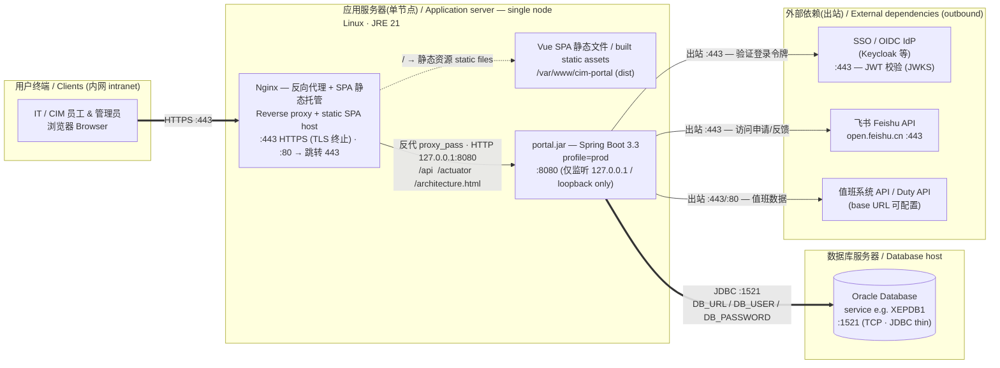

# CIM Portal 部署架构 / Deployment Architecture

> 面向 CNO 部门的部署参考。聚焦系统级部署拓扑(单节点应用服务器 + 独立 Oracle 数据库),不涉及代码级结构。
> Deployment reference for the CNO team. System-level topology only (single app node + separate Oracle DB) — not code-level structure.

## 拓扑总览 / Topology



**一句话:** 浏览器经 **HTTPS 443** 访问应用节点的 **Nginx**;Nginx 直接提供 Vue 前端静态文件,并把 `/api` 等动态请求反向代理到本机 **8080** 上的 `portal.jar`;后端经 **JDBC 1521** 连接独立的 **Oracle**。前后端同源,无需 CORS。

**In one line:** the browser hits **Nginx** on the app node over **HTTPS 443**; Nginx serves the Vue static files and reverse-proxies `/api` (and friends) to `portal.jar` on local **8080**; the backend reaches the separate **Oracle** over **JDBC 1521**. Front and back are same-origin, so no CORS.

---

## 端口 / Ports

### 入站监听 / Inbound (listening)

| 组件 Component | 绑定 Bind | 端口 Port | 协议 Protocol | 可达范围 Reachable from | 说明 Notes |
|---|---|---|---|---|---|
| Nginx | `0.0.0.0` | **443** | HTTPS / TCP | 用户内网 intranet | 门户唯一入口;TLS 在此终止 |
| Nginx | `0.0.0.0` | **80** | HTTP / TCP | 用户内网 | 可选,301 跳转到 443 |
| portal.jar | `127.0.0.1` | **8080** | HTTP / TCP | **仅本机 loopback** | 后端 API;只允许 Nginx 反代访问,不对外暴露 |
| Oracle | DB host | **1521** | TCP (JDBC) | **仅应用节点** | 数据库监听 |

> 关键:**8080 不要对外开放**,仅绑定 `127.0.0.1`,由 Nginx 同机反代。`server.port` 未自定义,默认 8080。
> Key: **do not expose 8080**; bind it to loopback and reach it only through the local Nginx. No custom `server.port` — Spring Boot default 8080.

### 出站连接 / Outbound (from app node)

| 源 From | 目标 To | 端口 Port | 协议 | 何时 When |
|---|---|---|---|---|
| portal.jar | Oracle DB host | **1521** | TCP / JDBC | 始终 always |
| portal.jar | OIDC IdP (issuer) | **443** | HTTPS | 登录令牌校验(`prod` = oidc 模式),拉取 JWKS |
| portal.jar | `open.feishu.cn` | **443** | HTTPS | 管理员启用飞书后:访问申请 / 意见反馈 |
| portal.jar | 值班系统 API | **443 / 80** | HTTP(S) | 管理员配置值班接口后:拉取当班数据 |

---

## 防火墙要点 / Firewall summary (CNO)

- **入站到应用节点**:仅放行 **443**(及可选 **80**)来自用户网段。其余一律拒绝。
- **8080 / 1521 不对用户开放**:8080 仅 loopback;1521 仅应用节点 → DB host。
- **应用节点 → 数据库节点**:放行 **1521**。
- **应用节点 出站**:放行 **443**(IdP、飞书)与值班 API 端口;如内网无外网出口,飞书/值班为可选功能,可不放行(届时这两项功能不可用,核心门户不受影响)。

---

## 运行环境与配置 / Runtime & configuration

| 项 Item | 值 Value |
|---|---|
| 运行时 Runtime | JRE 21 (Temurin 21) |
| 启动 Launch | `java -jar portal.jar --spring.profiles.active=prod` |
| Profile | `prod`(真实 OIDC SSO;Swagger 已禁用) |
| 数据库连接 DB | 环境变量 `DB_URL` = `jdbc:oracle:thin:@//<db-host>:1521/<service>`、`DB_USER`、`DB_PASSWORD` |
| 数据库迁移 Migrations | Flyway 启动时自动执行(当前 schema 版本 **V19**),`ddl-auto=validate` |
| 健康检查 Health | `GET /actuator/health` → `{"status":"UP"}` |
| 上传限制 Upload | 单文件 / 请求 ≤ **1MB**(图标上传) |
| SSO 配置 | `prod` 为 `oidc` 模式;issuer / clientId 由管理员在门户 **SSO** 页配置 |
| 飞书 / 值班凭据 Lark/Duty | **不是环境变量**;运行时由管理员在门户「飞书」「值班电话→接口设置」页填写,加密/掩码存于 DB |

> 机密(DB 密码经环境变量;飞书 App Secret、值班 API Key 存库且永不回传浏览器)。
> Secrets: DB password via env; Feishu app secret & duty API key are stored in the DB and never returned to the browser.

---

## Nginx 参考配置 / Reference server block

```nginx
# —— 压缩 / compression(对文本类响应,显著减小 JS/CSS/JSON 传输) ——
gzip              on;
gzip_comp_level   6;
gzip_min_length   1024;
gzip_vary         on;
gzip_proxied      any;
gzip_types        text/plain text/css application/javascript application/json
                  image/svg+xml application/manifest+json;
# 可选 brotli(需 ngx_brotli 模块;通常比 gzip 再小 ~15%):
# brotli on; brotli_comp_level 6;
# brotli_types text/plain text/css application/javascript application/json image/svg+xml;

server {
    listen 443 ssl;
    http2 on;                                   # HTTP/2(多路复用,降低多文件加载延迟)
    server_name portal.example.com;             # 改为实际域名

    ssl_certificate     /etc/ssl/cim-portal/fullchain.pem;
    ssl_certificate_key /etc/ssl/cim-portal/privkey.pem;

    root /var/www/cim-portal;
    index index.html;

    # —— 带内容哈希的静态资源:永久强缓存(文件名变更即失效) ——
    # Vite 产物 /assets/<name>-<hash>.{js,css,woff2,...} 内容寻址,可安全长缓存。
    location /assets/ {
        access_log off;
        add_header Cache-Control "public, max-age=31536000, immutable";
        try_files $uri =404;
    }

    # —— Vue SPA 入口:不缓存,确保发版后立即拉到新 index 与新资源引用 ——
    location / {
        try_files $uri $uri/ /index.html;
    }
    location = /index.html {
        add_header Cache-Control "no-cache";
    }

    # —— 反向代理到后端(同机 loopback) ——
    location /api            { proxy_pass http://127.0.0.1:8080; }
    location /actuator       { proxy_pass http://127.0.0.1:8080; }   # 健康检查,可仅限内网
    location /architecture.html { proxy_pass http://127.0.0.1:8080; } # 可选:管理员架构图

    proxy_set_header Host              $host;
    proxy_set_header X-Real-IP         $remote_addr;
    proxy_set_header X-Forwarded-For   $proxy_add_x_forwarded_for;
    proxy_set_header X-Forwarded-Proto $scheme;

    client_max_body_size 1m;                    # 与后端 1MB 上传上限一致
}

server {                                        # 80 → 443 跳转(可选)
    listen 80;
    server_name portal.example.com;
    return 301 https://$host$request_uri;
}
```
> 性能要点 / Perf notes:
> - **gzip**(或 brotli)对 JS/CSS/JSON 通常压到原大小的 ~30–40%(如主包 224KB → ~83KB)。
> - `/assets/*` 内容哈希文件 **immutable 长缓存**;`index.html` **no-cache** 保证发版即时生效。
> - **http2** 降低同时加载多个分包(懒加载 chunk)的连接开销。
> - 注意:`gzip`/`brotli` 指令置于 `http {}` 上下文(此处示意写在 server 外);`/swagger-ui.html` 与 `/dev/token` 在 `prod` 下禁用/不存在,无需反代。
> Note: put `gzip`/`brotli` in the `http {}` context; `/swagger-ui.html` and `/dev/token` are disabled/absent under `prod`.

---

## 部署步骤 / Deployment steps

1. **Oracle**(数据库节点):创建用户/Schema `cim_portal` 并授权(建表权限);记录 service 名(如 `XEPDB1`)。Flyway 会在应用首启时自动建表,无需手工执行 DDL。
2. **应用节点**:安装 **JRE 21** 与 **Nginx**;开放入站 443/80。
3. **后端**:部署 `portal.jar`;设置环境变量 `DB_URL` / `DB_USER` / `DB_PASSWORD`;以 `systemd` 服务运行 `--spring.profiles.active=prod`,绑定 `127.0.0.1:8080`。
4. **前端**:`npm run build` 产出 `dist/`,放到 `/var/www/cim-portal`;套用上面的 Nginx 配置(`VITE_API_BASE_URL` 留空 → 前端按相对路径 `/api` 调用,实现同源)。
5. **TLS**:在 Nginx 443 配置证书。
6. **首启**:启动后端 → Flyway 自动迁移至 V19;用管理员账号登录门户,在 **SSO / 飞书 / 值班电话** 页填写各自配置。
7. **验证**:`curl -k https://<host>/actuator/health` 返回 `UP`;浏览器打开门户登录正常。

---

## 变更记录 / Change log
- 2026-06-15 初版(单节点 Nginx + portal.jar,独立 Oracle)。
